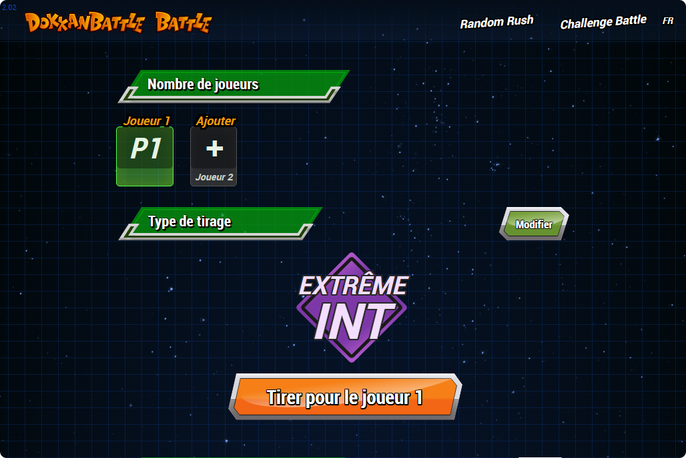
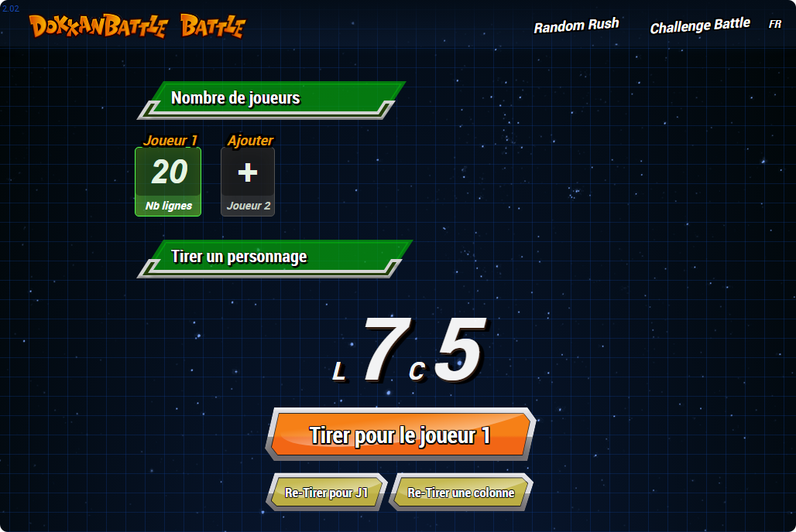

# Dokkan Battle Battle

## Description
Dokkan Battle Battle is a platform where you can challenge your friends in multiplayer modes for the Dragon Ball Z Dokkan Battle game. This project enhances the gaming experience with modes created by passionate YouTubers.

## Features
- **Challenge Battle**: Form a team of 6 characters based on their types.
- **Random Rush**: Create a team of 6 random characters.
 
#### Challenge Battle

#### Random Rush


## Installation
1. Clone the repository:
   ```sh
   git clone https://github.com/nvigneux/dokkan-battle-battle.git
   ```
2. Navigate to the project directory:
   ```sh
   cd dokkan-battle-battle
   ```
3. Install dependencies:
   ```sh
   npm install
   ```
4. Run the development server:
   ```sh
   npm run dev
   ```

## Usage
Visit [Dokkan Battle Battle](https://dokkanbattlebattle.com) to start playing with your friends.

## Contributing
1. Fork the project.
2. Create your feature branch (`git checkout -b feature/AmazingFeature`).
3. Commit your changes (`git commit -m 'Add some AmazingFeature'`).
4. Push to the branch (`git push origin feature/AmazingFeature`).
5. Open a Pull Request.

## Contact
For questions or suggestions, reach out on [Twitter](https://twitter.com/dokkanbattlex2) or email us at dokkanbattlebattle.contact@gmail.com.

## License
This project is licensed under the MIT License. See the [LICENSE](LICENSE) file for details.

---

Visit our website for more information: [Dokkan Battle Battle](https://dokkanbattlebattle.com).

If you enjoy using this project, please consider supporting us on [Buy Me a Coffee](https://www.buymeacoffee.com/nvigneux).
